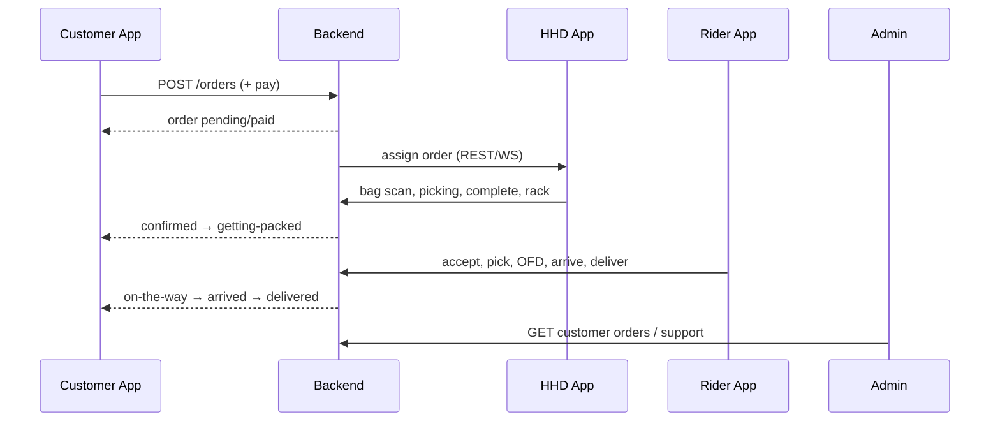

# 14 — Cross-App Workflow

End-to-end happy path with real apps, APIs, and status vocabularies.

---

## Storyboard

### 1. Customer places order

| Field | Value |
|-------|-------|
| App | Customer |
| Screen | Payment |
| Action | Confirm pay |
| API | `POST /api/v1/customer/orders` then Worldline/COD/wallet path |
| Backend | Creates customer order (`pending`); payment session if online |
| Next app | Backend / payment |
| Next screen | Customer OrderStatus |

### 2. Payment succeeds / COD accepted

| Field | Value |
|-------|-------|
| App | Customer |
| APIs | `POST /payments/worldline/complete` (online) or COD path |
| Backend | `paymentStatus` → `paid` or `cod_pending`; fulfillment release; darkstore order creation/assignment integrations |
| Customer status | still/toward `pending`→`confirmed` depending on sync timing |
| Next | Darkstore / HHD |

### 3. Picker workforce context

| Field | Value |
|-------|-------|
| App | Picker app | May only show order **counts** on home while on shift |
| HHD | Receives assign via API list + Socket `assignorder:assigned` |
| Darkstore | `ASSIGNED` → propagates customer `confirmed` |

### 4. HHD receives & picks

| Step | App | Screen | Action | API | Backend state | Next |
|------|-----|--------|--------|-----|---------------|------|
| Incoming | HHD | orderReceived | Open | GET orders status pending | HHD `pending` | bagScan |
| Bag | HHD | bagScan | Scan QR | POST `/bags/scan` | `bag_scanned` | overview |
| Start | HHD | orderOverview | Start | PUT `/orders/:id/status` `{picking}` | HHD `picking`; darkstore `PICKING`; customer `confirmed` | activePickSession |
| Scan items | HHD | activePickSession | Scan | POST `/scanned-items` | item scanned | — |
| Not found | HHD | activePickSession | Mark | PUT `/items/:id/not-found` | item `not_found` | — |
| Complete | HHD | orderCompletion | Complete | PUT assignorders status `completed` | HHD `completed`; darkstore `PICKED`; customer → `getting-packed` (via map) | photo |
| Photo | HHD | photoInsideBag | Capture | POST `/photos` | photo / bag | rack |
| Rack | HHD | scanRackQR | Scan | POST `/racks/scan` | `rack_assigned` | orderComplete |

### 5. Rider assignment & accept

| Field | Value |
|-------|-------|
| App | Rider |
| Screen | Live orders |
| Action | Accept |
| API | `POST /api/v1/orders/:id/accept` |
| Backend | Rider assignment accepted; status in `assigned` family |
| Next | Travel to darkstore |

### 6. Rider pickup

| Action | API | Rider status | Customer |
|--------|-----|--------------|----------|
| Arrive store | `.../arrived-at-darkstore` | `arrived_at_darkstore` | — |
| Pick bag | `.../pick` | `picked` | → `on-the-way` (chain walk) |

### 7. Rider delivers

| Action | API | Rider status | Customer |
|--------|-----|--------------|----------|
| OFD | `.../out-for-delivery` | `out_for_delivery` | `on-the-way` |
| Arrive | `.../arrived-at-customer` | `arrived_at_customer` | `arrived` |
| OTP | `.../otp/send|verify` | — | — |
| Photo | `.../proof/photo` | — | — |
| Deliver | `.../deliver` | `delivered` | `delivered` (+ COD paid) |

### 8. Customer receives

| App | Screen | API |
|-----|--------|-----|
| Customer | OrderStatusMain → OrderReceived | `GET /orders/active` observes `delivered` |

### 9. Admin sees final order

| App | Screen | API |
|-----|--------|-----|
| Admin | Customer Management drawer | `GET /admin/customers/:id/orders` |
| Support | Ticket tools | refund / redelivery if needed |
| Citywide | Metrics | live-metrics / exceptions |

---

## Sequence diagram

---

## Failure branches (cross-app)

| Failure | Where | Effect |
|---------|-------|--------|
| Payment fail | Customer | Order unpaid; retry; no fulfillment |
| Customer cancel | Customer | `cancelled` if policy allows |
| Darkstore cancel/RTO | Darkstore | customer `cancelled` |
| HHD pause/cancel | HHD assignorders status | operational pause/cancel |
| Rider reject | Rider | reassignment — exact auto-reassign **VERIFY** |
| Missing items | HHD complete | auto-refund path possible |

---

## App responsibility cheat sheet

| Concern | Owner app |
|---------|-----------|
| Browse/cart/pay/track | Customer |
| Shift/onboarding/payouts | Picker |
| Scan/pick/pack/rack | HHD |
| Delivery OTP/POD | Rider |
| Catalog/CMS/support/citywide | Admin |
| Assign/pick board (ops) | Darkstore dashboard (sibling) |
